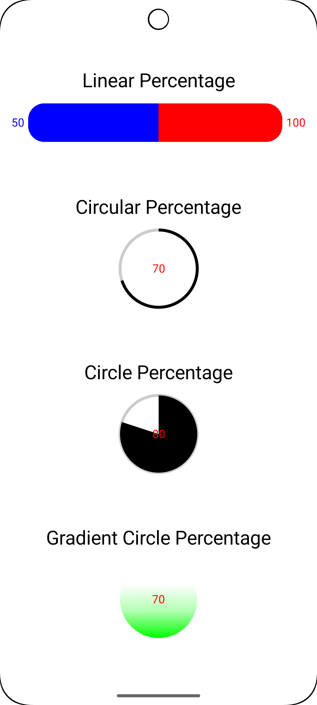
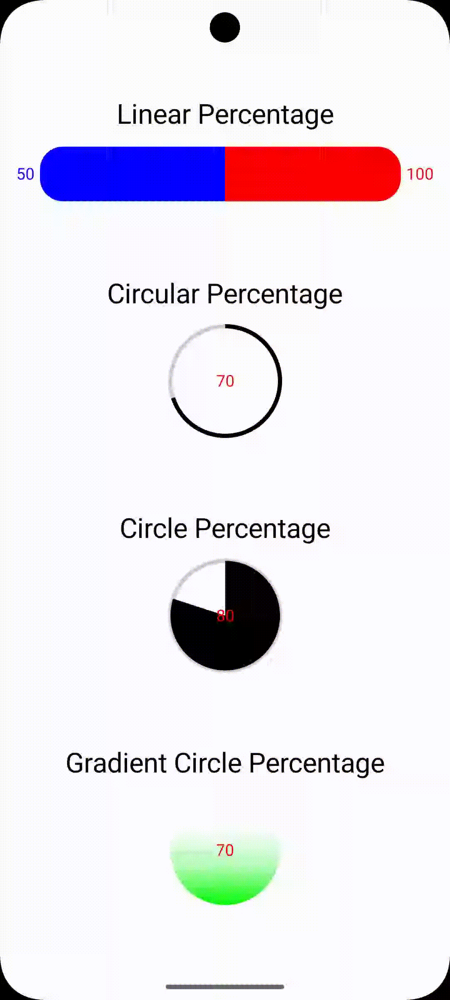

# Percentages with Animation Compose

This library built to give to other developers an easy way to implement percentages with custom
Compose view and animation such as linear, circular,
circle and gradient circle percentages. <br />
Support me and I will appreciate if you provide me your feedback(s).<br />

The library contain/features:

- Linear Percentage
- Circular Percentage
- Circle Percentage
- Gradient Circle Percentage

... with customizations.

### Versioning

Gradle Version 8.5.2 <br />
Kotlin Version 2.0.10 <br />
JDK Version 17 <br />
Minimum SDK 27 <br />
Target SDK 34 <br />
Build Tool Version 34 <br />

## IMPORTANT NOTE

THE BETA RELEASES MAYBE CONTAIN MAJOR/MINOR CHANGES

## Basic Configuration

[](https://jitpack.io/#NicosNicolaou16/PercentagesWithAnimationCompose)

### Groovy

```Groovy
implementation 'com.github.NicosNicolaou16:PercentagesWithAnimationCompose:1.0.1'
```

```Groovy
allprojects {
    repositories {
        maven { url "https://jitpack.io" }
    }
}
```

### Kotlin DSL

```Kotlin
implementation("com.github.NicosNicolaou16:PercentagesWithAnimationCompose:1.0.1")
```

```Kotlin
dependencyResolutionManagement {
    //...
    repositories {
        //...
        maven { url = uri("https://jitpack.io") }
    }
}
```

### libs.versions.toml

```toml
[versions]
# other versions here...
percentagesWithAnimationComposeVersion = "1.0.1"

[libraries]
# other libraries here...
percentages-with-animation-compose = { group = "com.github.NicosNicolaou16", name = "PercentagesWithAnimationCompose", version.ref = "percentagesWithAnimationComposeVersion" }
```

```Kotlin
dependencyResolutionManagement {
    //...
    repositories {
        //...
        maven { url = uri("https://jitpack.io") }
    }
}
```

<p align="left">
  <a title="simulator_image"></a>
  <a title="simulator_image"></a>
</p>

### Linear Percentage

| Parameters                    | Description                                                                                                                                                 |
|-------------------------------|-------------------------------------------------------------------------------------------------------------------------------------------------------------|
| `currentPercentage`           | The current value of the Linear Percentage (current value must be less than or equal to maximum value currentValue >= 0 && currentValue <= maximumValue)    |
| `maxPercentage`               | The maximum value of the Linear Percentage (maximum value must be greater than or equal to current value maximumValue >= 0 && maximumValue >= currentValue) |
| `percentageAnimationDuration` | The duration of the percentage animation, default value is 1500ms                                                                                           |
| `heightPercentageBackground`  | The height of the background of the Linear Percentage                                                                                                       |
| `heightPercentage`            | The height of the Linear Percentage                                                                                                                         |
| `colorPercentageBackground`   | The color of the background of the Linear Percentage                                                                                                        |
| `colorPercentage`             | The color of the Linear Percentage                                                                                                                          |
| `startTextEndPadding`         | The padding of the start text, default value is 5                                                                                                           |
| `endTextStartPadding`         | The padding of the end text, default value is 5                                                                                                             |
| `roundedCornerShapeValue`     | The rounded corner shape value, default value is 0                                                                                                          |
| `horizontalPadding`           | The horizontal padding left and right of the Linear Percentage, default value is 0                                                                          |
| `startTextStyle`              | The style of the start/lest text (Optional)                                                                                                                 |
| `endTextStyle`                | The style of the end/right text (Optional)                                                                                                                  |
| `leftAndRightText`            | The left and right text, accepted values are `LEFT_ONLY`, `RIGHT_ONLY`, `BOTH` and `NONE`, default value is `NONE`                                          |

### Circular Percentage

| Parameters                          | Description                                                                                                                                                 |
|-------------------------------------|-------------------------------------------------------------------------------------------------------------------------------------------------------------|
| `currentPercentage`                 | The current value of the Linear Percentage (current value must be less than or equal to maximum value currentValue >= 0 && currentValue <= maximumValue)    |
| `maxPercentage`                     | The maximum value of the Linear Percentage (maximum value must be greater than or equal to current value maximumValue >= 0 && maximumValue >= currentValue) |
| `circularSize`                      | The size of the circular percentage, default value is 100                                                                                                   |
| `percentageAnimationDuration`       | The duration of the animation in milliseconds, default value is 1500ms                                                                                      |
| `circularPercentageBackgroundColor` | The background color of the circular percentage, default value is LightGray                                                                                 |
| `circularPercentageColor`           | The color of the circular percentage, default value is Black                                                                                                |
| `circularStrokeBackgroundWidth`     | The width of the background stroke of the circular percentage, default value is 10                                                                          |
| `circularStrokeWidth`               | The width of the stroke of the circular percentage, default value is 10                                                                                     |
| `centerTextStyle`                   | The text style of the center of the circular percentage                                                                                                     |

### Circle Percentage

| Parameters                          | Description                                                                                                                                                 |
|-------------------------------------|-------------------------------------------------------------------------------------------------------------------------------------------------------------|
| `currentPercentage`                 | The current value of the Linear Percentage (current value must be less than or equal to maximum value currentValue >= 0 && currentValue <= maximumValue)    |
| `maxPercentage`                     | The maximum value of the Linear Percentage (maximum value must be greater than or equal to current value maximumValue >= 0 && maximumValue >= currentValue) |
| `circularSize`                      | The size of the circular percentage, default value is 100                                                                                                   |
| `percentageAnimationDuration`       | The duration of the animation in milliseconds, default value is 1500ms                                                                                      |
| `circularPercentageBackgroundColor` | The background color of the circular percentage, default value is LightGray                                                                                 |
| `circularPercentageColor`           | The color of the circular percentage, default value is Black                                                                                                |
| `circularStrokeBackgroundWidth`     | The width of the background stroke of the circular percentage, default value is 10                                                                          |
| `centerTextStyle`                   | The text style of the center of the circular percentage                                                                                                     |

### Gradient Circle Percentage

| Parameters                    | Description                                                                                                                                                 |
|-------------------------------|-------------------------------------------------------------------------------------------------------------------------------------------------------------|
| `currentPercentage`           | The current value of the Linear Percentage (current value must be less than or equal to maximum value currentValue >= 0 && currentValue <= maximumValue)    |
| `maxPercentage`               | The maximum value of the Linear Percentage (maximum value must be greater than or equal to current value maximumValue >= 0 && maximumValue >= currentValue) |
| `circularSize`                | The size of the circular percentage, default value is 100                                                                                                   |
| `listOfColors`                | The list of gradient colors (list of colors must not be empty)                                                                                              |
| `percentageAnimationDuration` | The duration of the animation, default value is 1500ms                                                                                                      |
| `centerTextStyle`             | The text style of the center text                                                                                                                           |

### Example

```Kotlin
import android.os.Bundle
import androidx.activity.ComponentActivity
import androidx.activity.compose.setContent
import androidx.activity.enableEdgeToEdge
import androidx.compose.foundation.background
import androidx.compose.foundation.layout.Column
import androidx.compose.foundation.layout.PaddingValues
import androidx.compose.foundation.layout.Spacer
import androidx.compose.foundation.layout.fillMaxSize
import androidx.compose.foundation.layout.size
import androidx.compose.material3.Scaffold
import androidx.compose.material3.Text
import androidx.compose.runtime.Composable
import androidx.compose.ui.Alignment
import androidx.compose.ui.Modifier
import androidx.compose.ui.graphics.Color
import androidx.compose.ui.text.TextStyle
import androidx.compose.ui.unit.dp
import androidx.compose.ui.unit.sp
import com.nicos.percentageswithanimationcompose.CirclePercentage
import com.nicos.percentageswithanimationcompose.LinearPercentage
import com.nicos.percentageswithanimationcompose.CircularPercentage
import com.nicos.percentageswithanimationcompose.GradientCirclePercentage
import com.nicos.percentageswithanimationcompose.enums.LeftAndRightText
import com.nicos.percentageswithanimationcomposeexample.ui.theme.PercentagesWithAnimationComposeTheme

class MainActivity : ComponentActivity() {
    override fun onCreate(savedInstanceState: Bundle?) {
        super.onCreate(savedInstanceState)
        enableEdgeToEdge()
        setContent {
            PercentagesWithAnimationComposeTheme {
                Scaffold(
                    modifier = Modifier
                        .fillMaxSize()
                ) { innerPadding ->
                    PercentagesWithAnimationCompose(innerPadding = innerPadding)
                }
            }
        }
    }
}

@Composable
fun PercentagesWithAnimationCompose(innerPadding: PaddingValues) {
    Column(
        modifier = Modifier
            .background(Color.White)
            .fillMaxSize(),
        horizontalAlignment = Alignment.CenterHorizontally
    ) {
        Spacer(modifier = Modifier.size(90.dp))
        Text(text = "Linear Percentage", style = TextStyle(color = Color.Black, fontSize = 25.sp))
        Spacer(modifier = Modifier.size(15.dp))
        LinearPercentage(
            currentPercentage = 50F,
            maxPercentage = 100F,
            heightPercentageBackground = 50,
            heightPercentage = 50,
            roundedCornerShapeValue = 21,
            horizontalPadding = 15,
            colorPercentageBackground = Color.Red,
            colorPercentage = Color.Blue,
            startTextStyle = TextStyle(color = Color.Blue, fontSize = 15.sp),
            endTextStyle = TextStyle(color = Color.Red, fontSize = 15.sp),
            leftAndRightText = LeftAndRightText.BOTH
        )

        Spacer(modifier = Modifier.size(70.dp))
        Text(text = "Circular Percentage", style = TextStyle(color = Color.Black, fontSize = 25.sp))
        Spacer(modifier = Modifier.size(15.dp))
        CircularPercentage(
            currentPercentage = 70F,
            maxPercentage = 100F,
            centerTextStyle = TextStyle(color = Color.Red, fontSize = 15.sp),
        )

        Spacer(modifier = Modifier.size(70.dp))
        Text(text = "Circle Percentage", style = TextStyle(color = Color.Black, fontSize = 25.sp))
        Spacer(modifier = Modifier.size(15.dp))
        CirclePercentage(
            currentPercentage = 80F,
            maxPercentage = 100F,
            centerTextStyle = TextStyle(color = Color.Red, fontSize = 15.sp),
        )

        Spacer(modifier = Modifier.size(70.dp))
        Text(
            text = "Gradient Circle Percentage",
            style = TextStyle(color = Color.Black, fontSize = 25.sp)
        )
        Spacer(modifier = Modifier.size(15.dp))
        GradientCirclePercentage(
            currentPercentage = 70F,
            maxPercentage = 100F,
            listOfColors = mutableListOf(
                Color.Green,
                (Color.Green.copy(alpha = 0.3f)),
                Color.White
            ),
            centerTextStyle = TextStyle(color = Color.Red, fontSize = 15.sp),
        )
    }
}
```